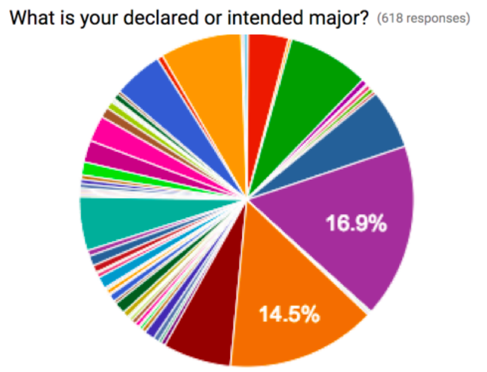
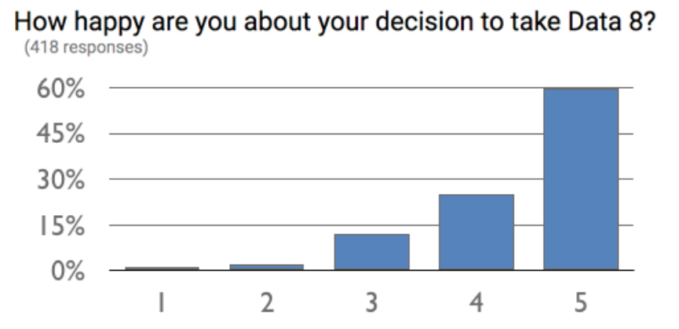

---
# YAML metadata
title: "The data science revolution in education: a report from the front lines"
author: "Matthew Brett"
bibliography: data-science-bib/data_science.bib
<#ifndef HANDOUT>
suppress-bibliography: true
<#endif>
---

# Undergraduate data science

> ... academic institutions should encourage the development of a basic
> understanding of data science in all undergraduates.

@natacad2018ds

> I think it likely that in ten years’ time every undergraduate programme will
> have to include some teaching in data science.

Professor Sir Adrian Smith, Director of Turing Institute, October 2019.

# But:

* What is data science?
* What should we teach?
* What is it going to look like?

# Data science in Berkeley

* February 2013: [Supporting Data Science
  Workshop](https://vcresearch.berkeley.edu/supporting-data-science-campus-wide-workshop-0)
* 2013: [Berkeley Institute of Data Science](https://bids.berkeley.edu/about)
* 2015: [Foundations of data science course](http://data8.org)
* 2018: [National workshop on data science
  education](https://data.berkeley.edu/undergraduate-ds-pedagogy)
* 2018: [Division of data science:
  announced](https://news.berkeley.edu/2018/11/01/berkeley-inaugurates-division-of-data-science-and-information-connecting-teaching-and-research-from-all-corners-of-campus)

# Berkeley teaching programme

* Massive (~1500 student) course [Foundations of data
  science](https://data.berkeley.edu/education/courses/data-8) - "Data 8".  No
  requirements in mathematics or programming.  Running since 2015.
* Large (~900 student) intermediate course [Principles and techniques of data
  science](http://www.ds100.org) with further requirements in Python programming and linear algebra.
* [27 Connector courses](https://data.berkeley.edu/education/connectors):
  domain applications of teaching methods from the foundation course.
* "... embracing a reinvention of statistical education in the era of
  pervasive computation." [Report by Data science education rapid reaction
  team](https://data.berkeley.edu/sites/default/files/datasciencecurriculumsketch.pdf)
* The greatest change in undergraduate teaching in a generation.

# Data 8 elements

*   **No Prerequisites** - There are no prerequisites besides the high school
    math that it took you to get to UC:
    *   No Math or Programming Background Required
*   **Easy to Access** - There is an easy-to-use computing platform that is
    integrated into every aspect of the course and works on any browser with
    no technical requirements
    *   No specific computer, software license, install needed
*   **Coding and Statistics** - There are advantages to learning coding at the
    same time as learning statistics  - *Computational Thinking, Inferential
    Thinking*
*   **Visualize First** - represent the data graphically in order to motivate
    questions about inference and concepts of statistics
*   **Minimize Formulas** - Don’t show or depend on formulas, delay formulas
    until the concept is explained, intuition and interpretation are more
    important
*   **Re-Sampling** - guide students towards non-parametric approaches by
    motivating resampling for hypothesis testing

Eric Van Dusen - slide deck from [2019
conference](https://data.berkeley.edu/academics/resources/data-science-education-workshops/2019-national-workshop-data-science-education)

# Principles of the course

* Teaching statistics "assuming computers exist, rather than assuming they
  don't exist."
* "Express in code what we would otherwise express in equations."

John DeNero, [2018
Webinar](https://www.youtube.com/watch?v=5KCNaA2MfoU&feature=youtu.be)

# Analyzing data: the three main steps

* The question, from some domain; reasonable assumptions about the data;
  choice of method
* Visualization and calculations
* Interpretation of the results in the language of the domain, without
  statistical jargon

Ani Adhikari - slide deck from [2019 conference](https://data.berkeley.edu/academics/resources/data-science-education-workshops/2019-national-workshop-data-science-education)

# The old approach

* The question, from some domain; reasonable assumptions about the data;
  choice of method
* Visualization and **calculations**
* Interpretation of the results in the language of the domain, without
  statistical jargon

# Data 8, extending the Berkeley approach

* The question, from some domain; reasonable assumptions about the data;
  choice of method
* Visualization and computation
* Interpretation of the results in the language of the domain, without
  statistical jargon

# A demo

To follow along: <http://bit.ly/swains_jury>

# Students, Spring 2019

* 49% first-years, 35% second-years
* 55% female
* 21% consider themselves to be a member of an underrepresented ethnic or
  racial minority within UC Berkeley
* Over 60 different majors
* At the start of the term, 38% said, “I have no skill at programming”

Ani Adhikari - slide deck from [2019 conference](https://data.berkeley.edu/academics/resources/data-science-education-workshops/2019-national-workshop-data-science-education)

# Students, Spring 2017

{height=70%}

Wide range of majors, > 14% slices are economics, computer science --
John DeNero, [2018 Webinar
materials](https://github.com/papajohn/dse-cal-data-science)

# Student feedback

John DeNero, [2018 Webinar
materials](https://github.com/papajohn/dse-cal-data-science)

# Student feedback, Spring 2019

* I never thought I would ever code or program but this class made it really
  approachable.
* Learn\[ed\] to code in a way that I feel will actually be useful for me in
  the future, even as someone in a social sciences major.
* Loved the problem-solving skills this class taught me and how Data 8 showed
  me the various ways data science could be applied to multiple disciplines!
* Data manipulation helped change literally how I see the world.

Ani Adhikari - slide deck from [2019 conference](https://data.berkeley.edu/academics/resources/data-science-education-workshops/2019-national-workshop-data-science-education)

# Coding is not a specialist skill

* understand what algorithms are, how they are implemented as programs on
  digital devices, and that programs execute by following precise and
  unambiguous instructions;
* create and debug simple programs;
* use logical reasoning to predict the behaviour of simple programs
* use technology purposefully to create, organise, store, manipulate and
  retrieve digital content

# Coding is not a specialist skill

* understand what algorithms are, how they are implemented as programs on
  digital devices, and that programs execute by following precise and
  unambiguous instructions;
* create and debug simple programs;
* use logical reasoning to predict the behaviour of simple programs
* use technology purposefully to create, organise, store, manipulate and
  retrieve digital content

[National curriculum in computing](https://www.gov.uk/government/publications/national-curriculum-in-england-computing-programmes-of-study/national-curriculum-in-england-computing-programmes-of-study): Key stage 1 (5-7 year olds).

# Undergraduate data science at the University of Birmingham

* 2017: Bioscience second year undergraduates; Introduction to R programming language.
* 2018: ["Data science for everyone" WHM](https://matthew-brett.github.io/dsfe2019)
* 2018: Geography first year undergraduates; Introduction to R.
* 2019: [Introduction to programming](https://matthew-brett.github.io/cfd2019)
  second-year undergraduate / MSc module (10 UK credits, run over one term).
* Plans to extend this approach across modules and schools.

# What do we need?

* debate
* vision
* mechanism

# What can we do?

* CPD to explain pedagogy.
* Harness commitment from faculty and students.

# The end

Materials at <https://github.com/matthew-brett/ds-rev>

<#ifdef HANDOUT>
# References
<#endif>
